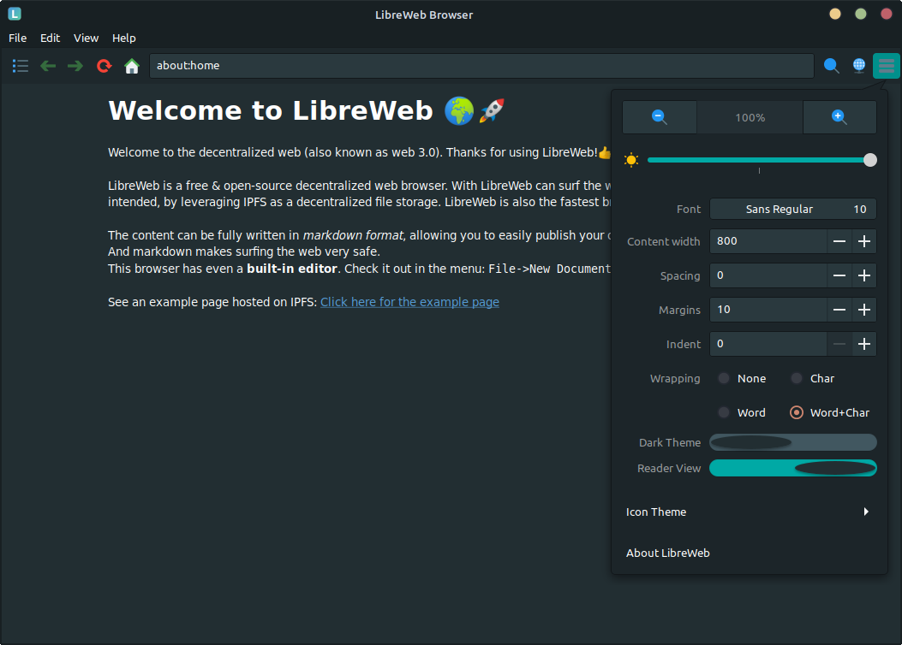

# LibreWeb Browser

LibreWeb is an **open-source decentralized web browser**, leveraging IPFS. What would you do different; if you could **reinvent** The Internet in 21st century?  
With all the knowledge and new technologies available today. I was inspired by Douglas Engelbart, Tim Berners-Lee and Ted Nelson as well as projects like IPFS, Jekyll, ARPANET and more.

[](https://gitlab.melroy.org/libreweb/browser/-/pipelines/latest)
[](https://t.me/libreweb)
[](https://matrix.to/#/#libreweb:melroy.org)
[](https://gitter.im/LibreWeb/Browser)
[](https://gitlab.melroy.org/libreweb/browser/-/milestones)
[](https://docs.libreweb.org/)
[](https://gitlab.melroy.org/libreweb/browser/-/releases)

*Note:* This project is still work in progress. However, we have a working [alpha version available](https://gitlab.melroy.org/libreweb/browser/-/releases).

## For Users

### Download

Just download the latest LibreWeb release and get started:

* [Download the latest release](https://gitlab.melroy.org/libreweb/browser/-/releases)

### Documentation

Visit the [dedicated documentation site](https://docs.libreweb.org) for *user* documentation.

### Screenshots

  


### Community

Join our [Telegram group](https://t.me/libreweb) or [Matrix channel](https://matrix.to/#/#libreweb:melroy.org?via=melroy.org) and become part of our community!

### Ideas / Features

The current success criteria:

* Everyone should be able to easily **read** and **create** a site/blog/news page and publish the content online (without minimal technical knowledge);
* Built-in easy-to-use **editor** (whenever you want to publish some content without programming language knowledge);
* **Decentralized** (no single-point of failure or censorship), like: P2P, DHT and IPFS;
* *No* client-server approach (the client is also the server and visa versa) - think **mesh network**.
* **Encrypted** transfers;
* Data is stored **redundantly** within the network (no single-point of failure);
* **Versioning**/revisions of content and documenents (automatically solves broken 'links', that can't happy anymore);
* Publisher user should be able to add additional information about the document/page, eg. title or path (similar in how Jekyll is using the `YML` format for meta data)
* Human-readable source-code (eg. `Markdown` format, could be extended as well);
* You are in control about the layout and styling (just like with e-books);
* Content is King;
* Fast and Extensible!

*Note:* Since HyperText (so is HTML) is not used, you can even ditch the HTTP protocol. However TLS, for encryption, can still be used.

---

The sections below are mainly relevant for software developers, who want to contribute or help the LibreWeb Browser project.

---

## For Developers

Decentralized Browser is written C++ together with some [external libraries](/lib). LibreWeb is using the [cmark-gfm](https://github.com/github/cmark-gfm) library for example, which is used for CommonMark (markdown) parsing.  
We're using markdown as the source-code of the content/site. No HTML and JavaScript anymore, content is king after all.

LibreWeb Browser is also using [Gnome GTK3](https://developer.gnome.org/gtk3/stable/) framework for the GUI. Using the C++ bindings, called [Gtkmm](https://gtkmm.org/en/).

### Development Environment

Personally, I'm using VSCodium editor, with the following extensions installed: `C/C++`, `CMake`, `CMake Tools`, `PlantUML`, `Markdown All in One`, `vscode-icons` and `GitLab Workflow`. But your local development setup is completely up to you.

### Linux Build Dependencies

For the **GNU/Linux build** you need at least:

* GCC 9 or higher (Packages: `build-essential g++-9`)
* CMake (Package: `cmake`)
* Ninja build system (Package: `ninja-build`)
* Libcurl (Package: `libcurl4-openssl-dev`)
* GTK3/Gtkmm3 (Package: `libgtkmm-3.0-dev`)

**Dependencies for testing:**

* X virtual framebuffer (Package: `xvfb`)
* Clang-format (Package: `clang-format`)

*Note:* For cross-compiling towards Windows and building on macOS see "[Other platforms](#Other%20platforms)" section below.

### Linux Build

Clone the source-code with SSH (do not forget `--recurse-submodules`):

```sh
git clone --recurse-submodules -j5 git@gitlab.melroy.org:libreweb/browser.git
```

Start the Linux build, which is using CMake and Ninja build system, using the wrapper script:

```sh
./scripts/build-lnx.sh
```

Optionally, use the VSCode `CMake Tools` extension to start the build or build with debug targets.

#### Linux Packaging

*Note:* (Linux) Packages are already [available under releases](https://gitlab.melroy.org/libreweb/browser/-/releases).

To build a release target yourself including packaging under GNU/Linux, use: `./scripts/build-lnx-prod.sh`

Root access is required when building Linux packages; add `/opt/mxe/usr/bin` to the secure_path using: `sudo visudo`.

### Unit testing (Linux)

To execute the **unit tests** you can configure with `cmake -DUNITTEST:BOOL=TRUE` and build. Execute: `ctest` command in the `tst` target directory.

Or just use script:

```sh
./scripts/build-run-tests.sh
```

### C++ Coding Style Guidelines

#### Automated Clang Format

We use our [own Clang LLVM C++ Programming Style Format](.clang-format), using [clang-format](https://clang.llvm.org/docs/ClangFormat.html) command.

To automatically comply to our style format execute following script (inplace edits are performed for you):

```sh
./scripts/fix-format.sh
```

Check only for errors, run: `./scripts/check-format.sh`

#### Core Guidelines

We also tend to follow the popular [C++ Core Guidelines](http://isocpp.github.io/CppCoreGuidelines/CppCoreGuidelines) as much as possible.

### Doxygen

See latest [Developer Documentation](https://gitlab.melroy.org/libreweb/browser/-/jobs/artifacts/master/file/build_docs/docs/html/index.html?job=doxygen).

Doxygen is build by default. You can disable the doxygen build, if you want, using: `cmake -DDOXYGEN:BOOL=FALSE ..`

### Memory Leaks

First **build** the (Linux) target including *debug symbols*. Binary should be present in the `build/src` folder.

Next, check for memory leaks using `valgrind` by executing:

```sh
./scripts/valgrind.sh
```

## Other platforms

### Microsoft Windows

We are [**cross-compiling**](https://en.wikipedia.org/wiki/Cross_compiler) towards **Windows** using GNU/Linux.

#### Windows Build Dependencies

* [MXE Gtkmm3 / Curl Binary packages](mxe.cc) (static build using Meson build with GCC11, see below for more info)
* CMake (Package: `cmake`)
* Ninja (Package: `ninja-build`)
* Nullsoft Scriptable Install System (Package: `nsis`)

For more information and the latest pre-build GTK3 Windows download, please my other [GTK 3 bundle repo](https://gitlab.melroy.org/melroy/gtk-3-bundle-for-windows).

**Note:** We're currently busy trying to upgrade the [whole GTK stack](https://github.com/danger89/mxe/tree/update_gtk).

We used the following build command to get the Windows dependencies and MXE cross-compilation toolset:

```sh
make gtkmm3 curl -j 16 MXE_TARGETS='x86_64-w64-mingw32.static' MXE_PLUGIN_DIRS='plugins/gcc10'
```

*NOTE:* Soon we need gcc11, but GTK3 upstream needs to create a new release that fixes the GCC11 builds.

Add the following line to the end of the `~/.bashrc` file:

```bash
export PATH="/opt/mxe/usr/bin:$PATH"
```

#### Windows Cross-compile Build

Please, be sure you meet all the requirements above. So your MXE environment should be ready in: `/opt/mxe/usr`.

To start the *cross-compile* build towards Windows 64-bit (using GNU/Linux as host) you can use the commands below.

Build a Windows development release:

```sh
./scripts/build-win.sh
```

Build a production release + packaging with [NSIS](https://sourceforge.net/projects/nsis/), execute the following:

```sh
./scripts/build-win-prod.sh
```

See also: [Windows ReadMe](windows.md) file.

### Apple MacOS / Darwin

#### MacOS Build Dependencies

* XCode (`xcode-select --install`)
* Brew (`/bin/bash -c "$(curl -fsSL https://raw.githubusercontent.com/Homebrew/install/master/install.sh)"`)
* CMake (brew: `cmake`)
* Libcurl (brew: `curl`)
* Gtk3/Gtkmm3 (brew: `gtkmm3`) 
* Ninja (brew: `ninja`)

#### MacOS Build

We're currently using [GitHub Actions](https://github.com/LibreWeb/Browser/blob/master/.github/workflows/macOS-build.yml) for the [macOS build](https://github.com/LibreWeb/Browser/actions/workflows/macOS-build.yml). You could already download the artifact if you want.

Packaging towards MacOS is still in progress.

## LibreWeb Research

For [research document](https://gitlab.melroy.org/libreweb/research_lab/-/blob/master/research.md) plus findings including explanation (like [diagrams](https://gitlab.melroy.org/libreweb/research_lab/-/blob/master/diagrams.md)) see the:

* [LibreWeb Research Lab Project](https://gitlab.melroy.org/libreweb/research_lab/-/tree/master)
